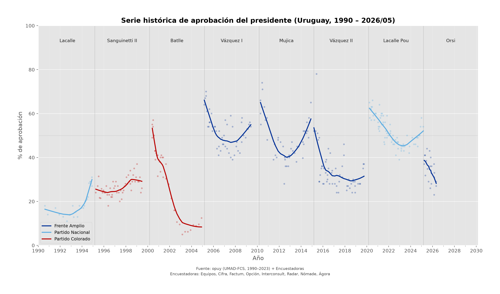
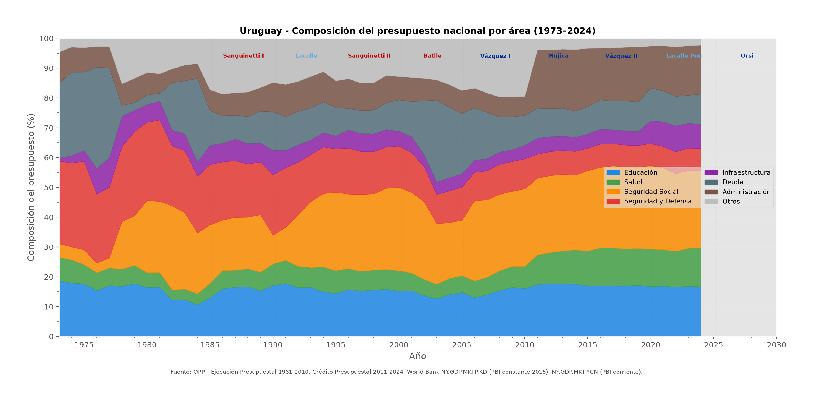
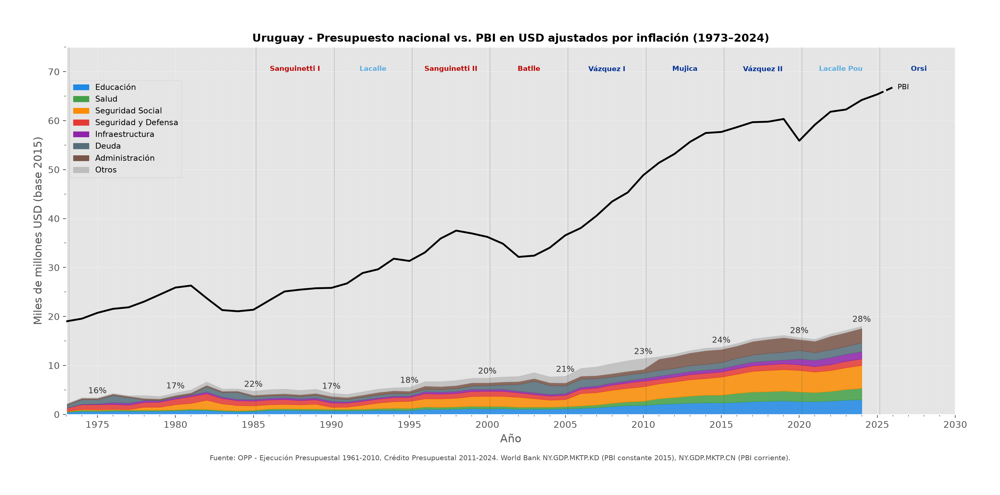
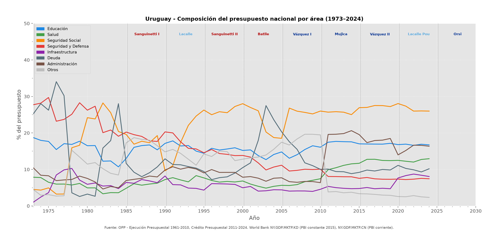
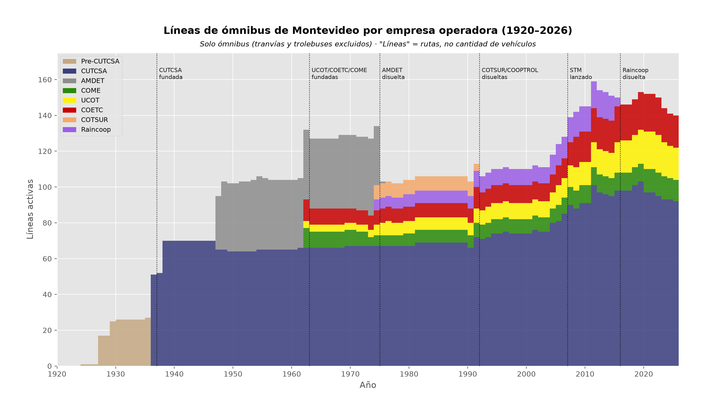
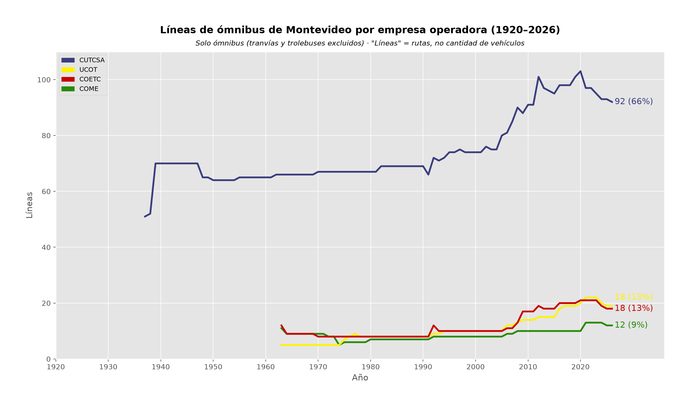
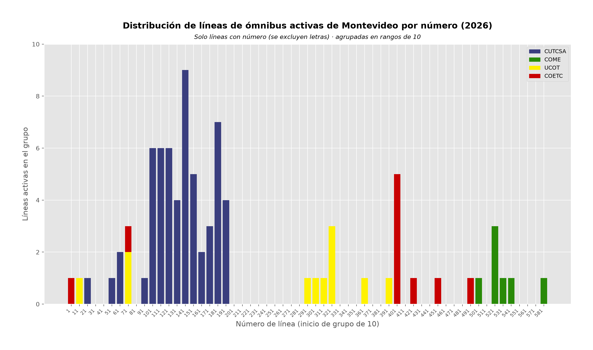
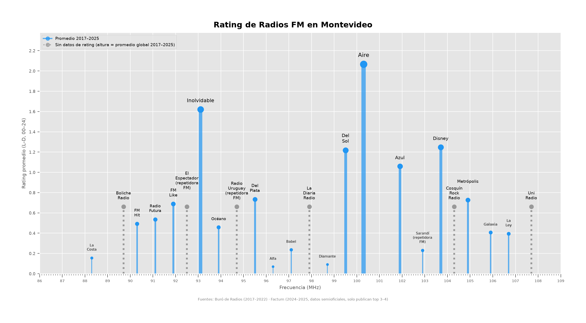
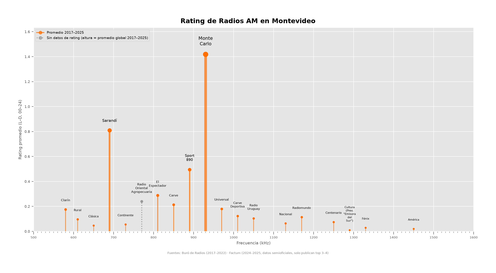

# uruguay-stats

Data analysis and visualization of Uruguayan quantitative data: electoral
statistics, government budgets, presidential approval, etc.

## Projects

### `approval/`

Presidential approval ratings from 1990 to 2026 using Opuy (UMAD-FCS) and
polling data.

[](https://colab.research.google.com/github/fabian-carini/uruguay-stats/blob/main/approval/approval.ipynb)



### `budget/`

National budget composition from 1973 to 2024 across eight sectors (Education,
Health, Social Security, Security/Defense, etc.). Combines OPP data with World
Bank GDP figures.

[](https://colab.research.google.com/github/fabian-carini/uruguay-stats/blob/main/budget/budget.ipynb)





### `bus/`

Montevideo bus line counts by operating company from 1920 to 2026. Tracks
CUTCSA, AMDET, COME, UCOT, COETC, Raincoop, COTSUR, and predecessors.

[](https://colab.research.google.com/github/fabian-carini/uruguay-stats/blob/main/bus/bus.ipynb)





### `radios/`

Montevideo radio dial charts showing average ratings (Buró de Radios
2017–2022 + Factum 2024–2025) per station, grouped by band.

[](https://colab.research.google.com/github/fabian-carini/uruguay-stats/blob/main/radios/radios.ipynb)




## Setup

Note: The project requires Python >= 3.14.

```bash
uv sync
```

Install dev dependencies (formatter, linter, type checker):

```bash
uv sync --dev
```

Run the smoke tests with:

```bash
./test.py
```

## Usage

```bash
./electoral/plot.py                    # single-chart project
./bus/plot.py                          # multi-chart: all variants (default)
./bus/plot.py -c stacked               # single variant
./bus/plot.py -c stacked,distribution  # selected variants
./bus/plot.py --no-open                # suppress opening the PNG
```

Outputs are saved, and the PNGs are opened in the system viewer
(cross-platform).

Jupyter notebooks can be generated from any tagged project:

```bash
./build_notebooks.py
```

Format, lint, and type-check all Python files:

```bash
uv run ruff format
uv run ruff check
uv run pyright
```

A pre-commit hook at `.githooks/pre-commit` automatically regenerates notebooks,
formats, lints, and type-checks before every `git commit`. Run
`uv run install-hooks` to enable it.

## Folder Structure

```txt
uruguay-stats/
├── README.md
├── pyproject.toml
├── build_notebooks.py*    # notebook generator
├── test.py*               # smoke tests
├── shared/                # shared code
│   ├── __init__.py
│   ├── stats.py
│   └── utils.py
├── project-one>/          # sub-project
│   ├── data/
│   ├── plot.py*
│   ├── <project-one>.svg
│   └── <project-one>.png
├── <project-two>/         # sub-project
│   ├── data/
│   ├── plot.py*
│   ├── <project-two>.svg
│   └── <project-two>.png
└── ...                    # more sub-projects
```

Each project lives in its own directory with its code in `plot.py` (executable
script, via python shebang), data in `data/`, and outputs (`{project}.svg`,
`{project}.png`, or `{project}-{variant}.{svg,png}` for multi-chart projects)
saved alongside the script at 200 DPI.

The `data/` folders can also contain scripts to process the data, and
`README.md` files with information about the data (sources, etc)

## `plot.py` requirements

Each project's `plot.py` is both a standalone CLI script and the source for
auto-generating Jupyter notebooks. 

These conventions are required:

- **Shebang**: Must start with `#! /usr/bin/env -S uv run python`.
- **Section markers**: Code is split into sections with `# --- SECTION NAME: <tag> ---`
  comments. Valid tags are `imports`, `constants`, `data loading`,
  `data processing`, `plot`, `metadata` (optional).
- **`VARIANTS` list** (in `metadata` section): Multi-chart projects declare
  variant names, e.g., `VARIANTS: list[str] = ["stacked", "per-company"]`.
- **Chart function naming**: Each variant's chart function is
  `plot_<variant-name>` with hyphens replaced by underscores (Example: variant
  `per-company` -> function `plot_per_company`).
- **`__main__` guard**: The CLI entry point must use `if __name__ ==
  "__main__":`. The notebook generator ignores this block and everything after
  it.

## `shared/` library

`shared/utils.py` provides shared code utilities.

`shared/stats.py` implements frequency tables, PMF, CDF, percentiles,
binomial/Poisson/exponential/normal distributions, KDE, and related tools from
scratch. While currently not in use by any project, it's intended as a
general-purpose statistics utility for future projects. So long as Python's
`statistics` library doesn't contain the required features already.

## Philosophy

The project aims to rely only on core Python and `matplotlib` wherever
possible. `nbformat` and `nbconvert` are also used for notebook generation.

`matplotlib` conventions in use include:
- `ggplot` style.
- Modern subplot/layout APIs usage (when needed): `subplot_mosaic`,
  `layout="constrained"`.

While there's currently some duplication in code patterns in the multiple
`plot.py` script, this is by design at the current scale of the project. We
prefer to keep the scripts self-contained, without the cost of extra
abstractions (besides the `stats.py` library).

The project uses `uv` for dependency management (`pyproject.toml` + `uv.lock`).

The project aims to use modern Python features, such as type hinting (even if
not fully used currently) and `pathlib` over `os.path`.

Spanish is the language used for annotations on the plot image outputs.
Similarly locale formatting (such as number formatting) is that used in
Uruguay.

The plot output files (`.svg`, `.png`) are currenty tracked in git (no
`.gitignore` currently exists). This is for developer convenience, but it
could be changed later.
